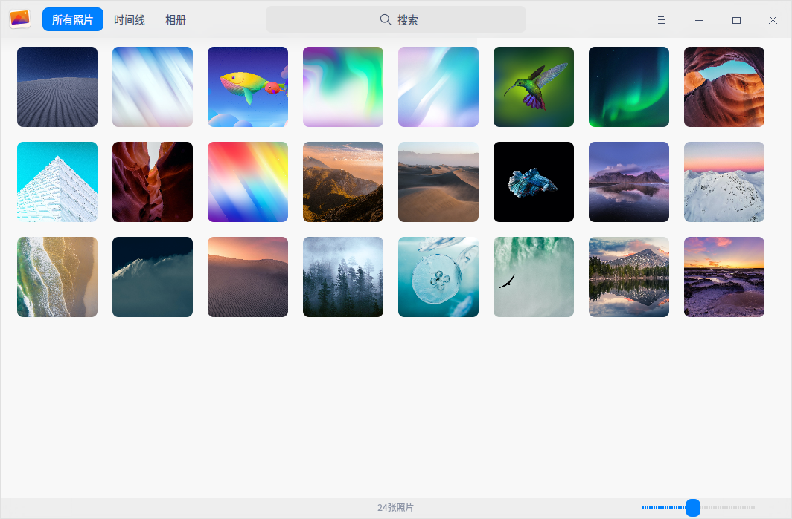
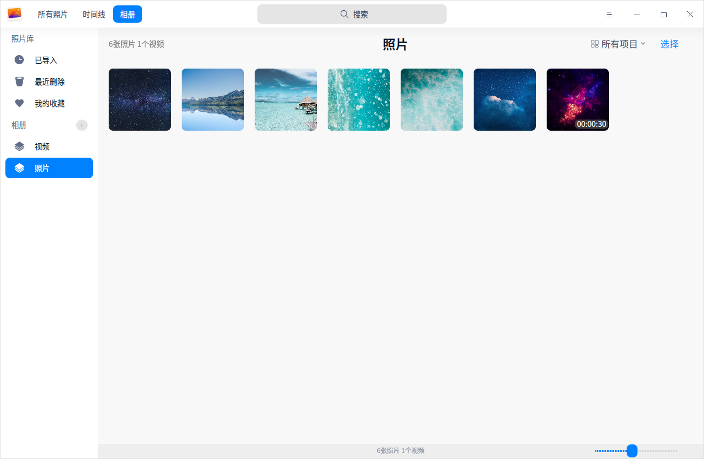

# 相册|deepin-album|

## 概述

相册是一款外观时尚、性能流畅的照片和视频管理工具，支持查看、管理多种图片和视频格式。您可以按日期时间线排列照片和视频，还可以将照片和视频添加到我的收藏，或者归类到不同的相册中，将照片和视频管理得井井有条。

## 使用入门

通过以下方式运行或关闭相册，或者创建相册的快捷方式。

### 运行相册

1. 单击任务栏上的启动器图标 ，进入启动器界面。
2. 上下滚动鼠标滚轮浏览或通过搜索，找到相册图标  ，单击运行。
3. 右键单击 ，您可以：
 - 单击 **发送到桌面**，在桌面创建快捷方式。
 - 单击 **发送到任务栏**，将应用程序固定到任务栏。
 - 单击 **开机自动启动**，将应用程序添加到开机启动项，在电脑开机时自动运行该应用。

   > 窍门：您可以在控制中心将相册设置为默认的照片查看程序，具体操作请参考 [默认程序设置](dman:///dde#默认程序设置)。

### 关闭相册

- 在相册界面，单击 ，退出相册。
- 在任务栏右键单击 ，选择 **关闭所有** ，退出相册。
- 在相册界面，单击 ，选择 **退出** ，退出相册。

### 查看快捷键

在相册界面，使用快捷键 **Ctrl + Shift + ?** 打开快捷键预览界面。熟练地使用快捷键，将大大提升您的操作效率。

## 照片和视频管理

启动相册后，通过时间线和相册来管理您的照片和视频。

### 导入照片和视频

在相册界面，可以采用以下方式导入照片和视频。

- 当相册中尚无照片和视频时，单击 **导入照片和视频**。
- 单击   >  **导入照片**。
- 直接将照片或视频文件拖拽到界面上。
- 从移动设备导入照片和视频。

### 搜索照片和视频

1. 在相册搜索框中，单击，输入关键字。
2. 按下键盘上的 **Enter** 键后显示搜索结果。

### 查看照片和视频

在相册界面，拖动右下角的滑块可以调整照片和视频的缩略图大小。

单击右上角的 **所有项目**，查看所有照片和视频；单击 **照片**，仅查看照片文件；单击 **视频**，仅查看视频文件。

双击照片或右键单击照片选择 **查看** ，进入查看图片界面；双击视频或右键单击视频选择 **查看**，进入影院界面播放视频文件。

| 图标                                                    | 名称       | 说明                         |
| ------------------------------------------------------- | ---------- | ---------------------------- |
|               | 返回       | 返回到主界面。               |
|                      | 上一张     | 显示上一张照片。             |
|                              | 下一张     | 显示下一张照片。             |
|                | 1:1视图    | 照片按照实际尺寸显示。       |
|              | 适应窗口   | 照片适应窗口尺寸显示。       |
|                        | 收藏       | 将喜欢的照片添加到个人收藏。 |
|  | 顺时针旋转 | 照片顺时针旋转90度。         |
|              | 逆时针旋转 | 照片逆时针旋转90度。         |
|                          | 删除       | 删除当前照片。               |

   > 窍门：滚动鼠标放大图片且当图片超出界面范围时，界面上会出现导航窗口。拖动导航窗口内的方框，查看该区域的信息。单击导航窗口中的关闭按钮 **×**，关闭导航窗口；也可以在界面上单击鼠标右键选择 **隐藏导航窗口** / **显示导航窗口**。

### 查看时间线

在时间线中，所有照片、视频按照拍摄时间和视频录制时间分组显示，不同日期的文件分栏排列。查看时间线可以快速找到某一天的文件。

### 打印照片

1. 在相册界面，右键单击照片，选择 **打印**。
2. 选择一个打印机，根据需要设置打印属性。
3. 选择 **打印**，将照片发送到打印机进行打印。

### 幻灯片放映

1. 在相册界面，右键单击照片。
2. 选择 **幻灯片放映**，照片将以幻灯片形式全屏播放。
3. 右键单击选择 **退出** 或按下键盘上的 **Esc** 键退出播放。

### 复制照片和视频

1. 在相册界面，右键单击照片或视频。
2. 选择 **复制**。
3. 在桌面或者指定位置，单击鼠标右键。
4. 选择 **粘贴**，将照片或视频文件复制到该位置。

### 收藏照片和视频

1. 在相册界面，右键单击照片或视频。
2. 选择 **收藏**，照片或视频文件将会添加到“我的收藏”。
3. 右键单击已收藏的照片或视频，也可以 **取消收藏**。

   > 窍门：您也可以单击界面右上角的 **选择**，选中多张照片或视频，单击收藏按钮  批量收藏照片或视频；再次单击 ，取消收藏。

### 旋转照片

1. 在相册界面，右键单击照片。
2. 选择 **顺时针旋转** / **逆时针旋转**。
3. 照片会顺时针转旋转90°/逆时针旋转90°。

 > 窍门：您也可以单击界面右上角的 **选择**，选中多张照片，单击旋转按钮  和  批量旋转照片。

### 设置为壁纸

1. 在相册界面，右键单击照片。
2. 选择 **设为壁纸**，将当前照片设置为壁纸。

### 在文件管理器中显示

1. 在相册界面，右键单击照片或视频。
2. 选择 **在文件管理器中显示**，定位照片或视频所在的文件夹位置。

### 查看照片和视频信息

1. 在相册界面，右键单击照片或视频。
2. 选择 **照片信息** 或 **视频信息**， 查看照片或视频的详细信息。

### 删除照片和视频

在相册中可通过以下方法之一删除照片或视频：

- 查看图片时，单击工具栏上的图标 。
- 在相册界面单击右上角 **选择**，选中照片或视频，单击图标 。
- 右键单击照片或视频，选择 **删除**。
- 选择照片或视频，按下键盘上的 **Delete** 键。

   > 窍门：在相册中删除的照片和视频并没有被永久删除，而是暂时存放在“最近删除”中。当剩余天数显示为0天时，照片和视频将被永久删除。您可以提前恢复或彻底删除这里的照片和视频。

## 相册管理

在相册界面，您可以新建相册，管理相册中的照片和视频，查看所有相册。

   > 说明：**已导入**、**最近删除**、**我的收藏** 是系统根据实际情况自动生成的，这三个相册不可删除、重命名。

### 新建相册

1. 在相册界面，单击按钮  或   > **新建相册**。
2. 输入相册名称，单击 **新建**。

   > 窍门：右键单击已创建的相册，也可以新建相册。您还可以在添加照片到相册时新建相册。

### 添加到相册

1. 在相册界面，右键单击照片或视频。
2. 选择 **添加到相册**。
3. 选择一个相册，将照片或视频添加到相册中。

   > 窍门：也可以直接将照片或视频文件拖拽到自定义的相册中。

### 从相册中移除

1. 在相册界面，右键单击相册中的照片或视频。
2. 选择 **从相册中移除**，将该照片或视频从相册中移除。

### 重命名相册

1. 在相册界面，右键单击相册。
2. 选择 **重命名**。
3. 输入相册名称，按下 **Enter** 键或者单击界面的空白区域保存修改。

### 导出相册

1. 在相册界面，右键单击相册。
2. 选择 **导出**。
3. 在弹出的文件管理器窗口中选择存储路径，单击 **保存**。

### 删除相册

1. 在相册界面，右键单击相册。
2. 选择 **删除**。
3. 在弹出的对话框中单击 **删除**。

## 主菜单

在主菜单中，您可以 [新建相册](#新建相册)、[导入照片](#导入照片)、切换窗口主题、查看帮助手册，了解相册的更多信息。

### 主题

窗口主题包含浅色主题、深色主题和系统主题。

1. 在相册界面，单击 。
2. 选择 **主题**，选择一个主题颜色。

### 帮助

查看帮助手册，进一步了解和使用相册。

1. 在相册界面，单击 。
2. 选择 **帮助**。
3. 查看相册的帮助手册。

### 关于

1. 在相册界面，单击 。
2. 选择 **关于**。
3. 查看相册的版本和介绍。

### 退出

1. 在相册界面，单击 。
2. 选择 **退出**。
