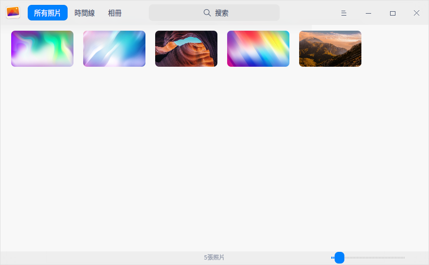
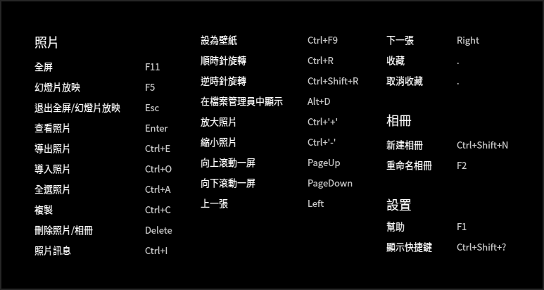
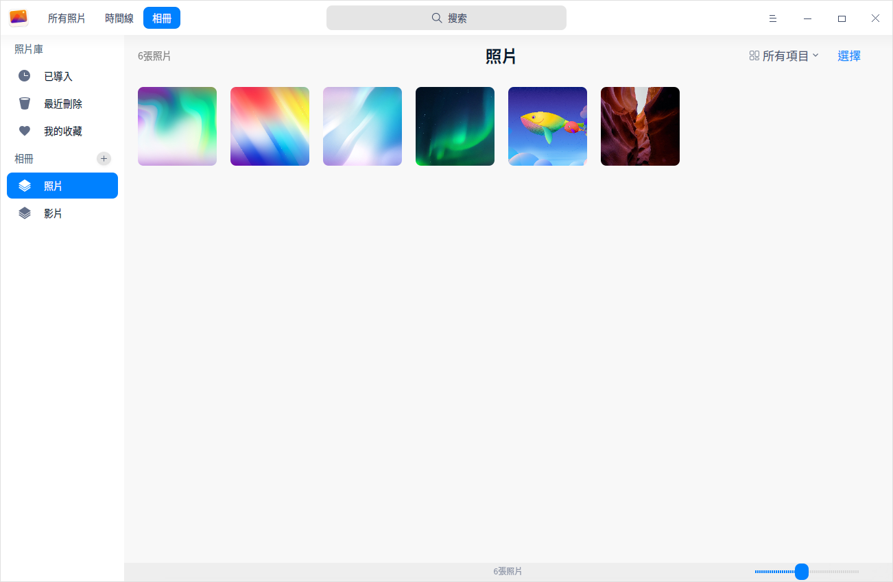

# 相冊|deepin-album|

## 概述

相冊是一款外觀時尚、性能流暢的照片管理工具，支持查看、管理多種圖片格式。可以按日期時間線排列照片，還可以將照片添加到個人收藏，或者歸類到不同的相冊中，將照片管理得井井有條。

## 使用入門

通過以下方式運行或關閉相冊，或者創建相冊的快捷方式。

### 運行相冊

1. 單擊任務欄上的啟動器圖標 ，進入啟動器界面。
2. 上下滾動鼠標滾輪瀏覽或通過搜索，找到相冊圖標 ，單擊運行。
3. 右鍵單擊 ，您可以：
 - 單擊 **傳送到桌面**，在桌面創建快捷方式。
 - 單擊 **傳送到任務欄**，將應用程序固定到任務欄。
 - 單擊 **加至開機啟動**，將應用程序添加到開機啟動項，在電腦開機時自動運行該應用。

   > 竅門：您可以在控制中心將相冊設置為默認的照片查看程序，具體操作請參考 [默認程序設置](dman:///dde#默認程序設置)。

### 關閉相冊

- 在相冊界面單擊  ，關閉相冊。
- 在任務欄右鍵單擊 ，選擇 **關閉所有**，關閉相冊。
- 在相冊界面單擊  ，選擇 **退出**，關閉相冊。

### 查看快捷鍵

在相冊界面，使用快捷鍵 **Ctrl + Shift + ?** 打開快捷鍵預覽界面，熟練地使用快捷鍵，將大大提升您的操作效率。

## 照片管理

啟動相冊後，通過時間線和相冊來管理您的照片。

### 導入照片

在相冊界面，可以採用以下方式導入照片。
- 當相冊中尚無照片時，單擊 **導入照片**。
- 單擊  > **導入照片**。
- 直接將照片或所在文件夾拖拽到界面上。
- 從移動設備導入照片。

   > 說明：相冊支持BMP、GIF、JPG、PNG、PBM、PGM、PPM、XBM、XPM、SVG、DDS、ICNS、MNG、TGA、TIFF、WBMP、WEBP、PSD、ICO、JNG、PCD、PCX、TIF、RAS、MRW、DNG、RAF、CR2、RAW、ORF、NEF等多種圖片格式。

### 搜索照片

1. 在相冊頂部的搜索框，單擊，輸入關鍵字。
2. 按下鍵盤上的 **Enter** 鍵後顯示搜索結果。

### 查看照片

在相冊界面上，拖動底部的滑塊調整照片的縮略圖大小。

雙擊照片，或右鍵單擊照片選擇 **查看** ，進入看圖界面；按 **Esc** 鍵退出看圖界面。

| 圖標                                               | 名稱       | 說明                         |
| -------------------------------------------------- | ---------- | ---------------------------- |
|          | 返回       | 返回到主界面。           |
|                 | 上一張     | 顯示上一張照片。             |
|                         | 下一張     | 顯示下一張照片。             |
|           | 1:1視圖    | 照片按照實際尺寸顯示。       |
|         | 適應窗口   | 照片適應窗口尺寸。       |
|                   | 收藏       | 將喜歡的照片添加到我的收藏列表中。 |
|  | 順時針旋轉 | 照片順時針旋轉90度。         |
|         | 逆時針旋轉 | 照片逆時針旋轉90度。         |
|                     | 删除       | 刪除當前照片。            |

   > 竅門：滾動鼠標放大圖片且當圖片超出界面範圍時，界面上會出現導航窗口。拖動導航窗口內的方框，查看該區域的訊息。單擊導航窗口右上角按鈕 **x** ，關閉導航窗口；也可以在看圖界面上單擊鼠標右鍵選擇 **隱藏導航窗口** / **顯示導航窗口**。   

### 查看時間線

在時間線中，所有照片按照日期劃分，同一天的照片顯示在一起，不同日期的照片分欄排列。查看時間線可以快速找到某一天的照片。

### 打印照片

1. 在相冊界面，單擊鼠標右鍵，選擇 **打印**。
2. 選擇一個打印機，根據需要設置打印屬性。
3. 選擇 **打印**，將照片發送到打印機進行打印。

### 幻燈片放映

1. 在相冊界面，右鍵單擊照片。
2. 選擇 **幻燈片放映**，照片將以幻燈片形式全螢幕播放。
3. 按下鍵盤上的 **Esc** 鍵退出播放。

### 複製照片

1. 在相冊界面，右鍵單擊照片。
2. 選擇 **複製**。
3. 在桌面或者指定位置，單擊鼠標右鍵。
4. 選擇 **黏貼**，將照片文件複製到該位置。

### 收藏照片

1. 在相冊界面，右鍵單擊照片。
2. 選擇 **收藏**，照片將會添加到「我的收藏」。
3. 右鍵單擊已收藏的照片，也可以 **取消收藏**。

   > 竅門：在查看照片時，單擊界面上的，將照片加入我的收藏。再次單擊，取消收藏。

### 旋轉照片

1. 在相冊界面，右鍵單擊照片。
2. 選擇 **順時針旋轉/逆時針旋轉**。
3. 照片將會順時針轉旋轉90°/逆時針旋轉90°。

> 說明：當使用觸控屏電腦時，二指放置在照片上並保持一定距離，同時旋轉二指來旋轉照片。

### 設置為壁紙

1. 在相冊界面，右鍵單擊照片。
2. 選擇 **設為壁紙** ，將當前照片設置為壁紙。

### 在檔案管理員中顯示

1. 在相冊界面，右鍵單擊照片。
2. 選擇 **在檔案管理員中顯示**，定位照片所在的文件夾位置。

### 查看照片訊息

1. 在相冊界面，右鍵單擊照片。
2. 選擇 **照片訊息**， 查看照片的各種訊息。

### 刪除照片

在相冊中通過如下方法刪除照片：

- 查看圖片時，單擊界面上的圖標 。
- 右鍵單擊照片，選擇 **刪除**。
- 在相冊界面，按下鍵盤上的 **Delete** 鍵。

   > 竅門：在相冊中刪除的照片並沒有被永久刪除，而是暫時存放在「最近刪除」中。當照片上的剩餘天數顯示為0天時，照片將被永久刪除。您可以提前恢復或徹底刪除這裏的照片。

## 相冊管理

在相冊界面，您可以新建相冊，管理相冊中的照片，查看所有相冊。

   > 說明：**已導入**、**最近刪除**、**我的收藏** 是系統根據實際情況自動生成的，這3個相冊不可刪除、重命名。

### 新建相冊

1. 在相冊界面，單擊  或  > **新建相冊**。
2. 輸入相冊名稱，單擊 **新建**。

   > 竅門：右鍵單擊已創建的相冊，也可以新建相冊。您還可以在添加照片到相冊時新建相冊。

### 添加照片到相冊

1. 在相冊界面，右鍵單擊照片。
2. 選擇 **添加到相冊**。
3. 選擇一個相冊，將照片添加到相冊中。

   > 竅門：也可以直接拖拽照片或照片文件夾到相冊中，添加照片到相冊。

### 移除相冊中的照片

1. 在相冊界面，右鍵單擊相冊中的照片。
2. 選擇 **從相冊中移除**，將照片從該相冊中移除。

### 重命名相冊

1. 在相冊界面，右鍵單擊相冊。
2. 選擇 **重命名**。
3. 輸入相冊名稱，按下 **Enter** 鍵或者單擊界面的空白區域保存修改。

### 導出相冊

1. 在相冊界面，右鍵單擊相冊。
2. 選擇 **導出** 。
3. 在彈出的窗口中選擇存儲路徑，單擊 **保存**。

### 刪除相冊

1. 在相冊界面，右鍵單擊相冊。
2. 選擇 **刪除**。
3. 在彈出的對話框中單擊 **刪除**。

## 主菜單

在主菜單中，您可以[新建相冊](#新建相冊)、[導入照片](#導入照片)、切換窗口主題、查看幫助手冊，了解相冊的更多訊息。

### 主題

窗口主題包含淺色主題、深色主題和系統主題。

1. 在相冊界面，單擊 。
2. 單擊 **主題**，選擇一個主題顏色。

### 幫助

查看幫助手冊，進一步了解和使用相冊。

1. 在相冊界面，單擊 。
2. 單擊 **幫助**。
3. 查看相冊的幫助手冊。

### 關於

1. 在相冊界面，單擊 。
2. 單擊 **關於**。
3. 查看相冊的版本和介紹。

### 退出

1. 在相冊界面，單擊 。
2. 單擊 **退出**。
