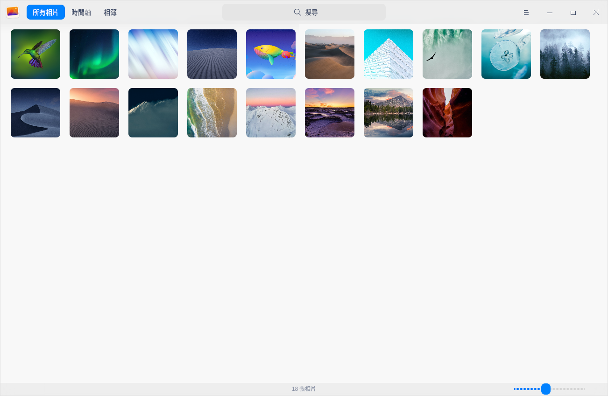
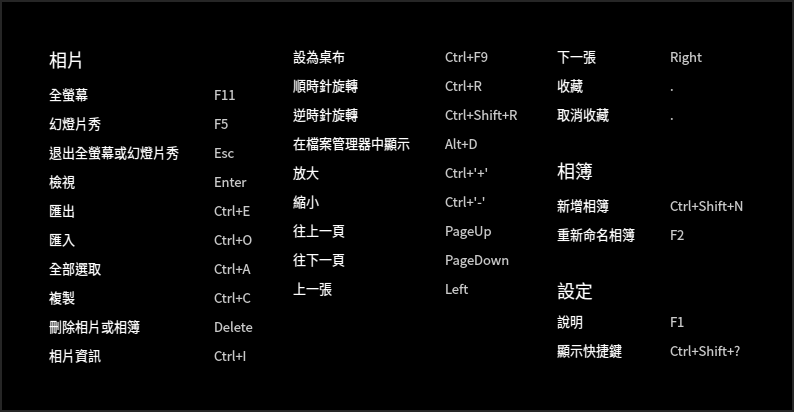
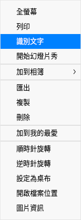
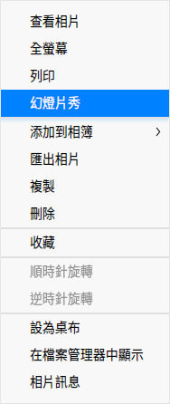
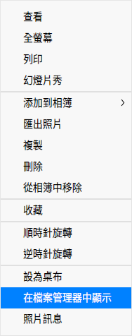
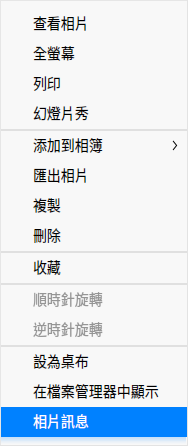
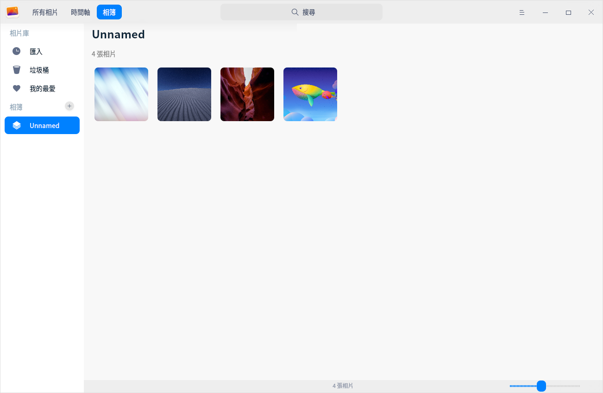
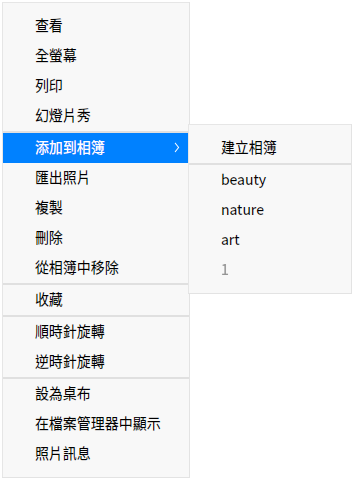

# 相簿|deepin-album|

## 概述

相簿是一款外觀時尚、性能流暢的照片和影片管理工具，支援查看、管理多種圖片和影片格式。您可以按日期時間軸排列照片和影片，還可以將照片和影片添加到我的最愛，或者歸類到不同的相簿中，將照片和影片管理得井井有條。

## 使用入門

透過以下方式執行或關閉相簿，或者建立相簿的捷徑。

### 執行相簿

1. 單擊任務欄上的啟動器圖示 ，進入啟動器介面。
2. 上下滾動滑鼠滾輪瀏覽或透過搜尋，找到相簿  單擊執行。
3. 右鍵單擊 ，您可以：
 - 單擊 **建立桌面捷徑**，在桌面建立捷徑。
 - 單擊 **釘選到Dock**，將應用程式固定到Dock。
 - 單擊 **開機啟動**，將應用程式添加到開機啟動項，在電腦開機時自動執行該應用。

   > 竅門：您可以在控制中心將相簿設定為預設的照片查看程式，具體操作請參考 [預設程式設定](dman:///dde#預設程式設定)。

### 關閉相簿

- 在相簿介面單擊  ，關閉相簿。
- 在任務欄右鍵單擊 ，選擇 **全部關閉** ，關閉相簿。
- 在相簿介面單擊  ，選擇 **退出** ，關閉相簿。

### 查看快捷鍵

在相簿介面上，使用快捷鍵 **Ctrl + Shift + ?** 打開快捷鍵預覽介面。熟練的使用快捷鍵，將大大提升您的操作效率。

## 照片和影片管理

相簿啟動後，您可以透過時間軸和相簿管理您的照片和影片。

### 匯入照片和影片

在相簿介面，可以採用以下方式匯入照片和影片。
- 單擊標題欄上的添加按鈕  。
- 當相簿中尚無照片和影片時，單擊 **匯入照片和影片**。
- 直接將照片或影片檔案拖曳到介面上。
- 從移動裝置匯入照片和影片。

### 搜尋照片和影片

1. 在相簿頂部的搜尋框，單擊 ，輸入關鍵字。
2. 按下鍵盤上的 **Enter** 鍵後顯示搜尋結果。

### 查看照片和影片

在相簿介面，拖動右下角的滑塊可以調整照片和影片的縮圖大小。

單擊右上角 **所有項目**，查看所有照片和影片；單擊 **照片**，僅查看照片檔案；單擊 **影片**，僅查看影片檔案。

雙擊照片或右鍵單擊照片選擇 **查看** ，進入查看圖片介面；按 **Esc** 鍵退出查看圖片介面；雙擊影片或右鍵單擊影片選擇 **查看**，進入影院介面播放影片檔案。

| 圖示                                                    | 名稱       | 說明                         |
| ------------------------------------------------------- | ---------- | ---------------------------- |
|               | 返回       | 顯示返回到主介面。           |
|                      | 上一張     | 顯示上一張照片。             |
|                              | 下一張     | 顯示下一張照片。             |
|                | 1:1檢視    | 照片按照實際尺寸顯示。       |
|              | 適應視窗   | 照片適應視窗尺寸顯示。       |
|                        | 收藏       | 將喜歡的照片添加到我的最愛。 |
|                                | 識別文字   | 識別圖片中的文字。           |
|  | 順時針旋轉 | 照片順時針旋轉90度。         |
|              | 逆時針旋轉 | 照片逆時針旋轉90度。         |
|                          | 刪除       | 刪除目前照片。               |

   > 竅門：滾動滑鼠放大圖片且當圖片超出介面範圍時，介面上會出現導航視窗。拖動導航視窗內的方框，查看該區域的訊息。單擊導航視窗右上角 **x** 按鈕，關閉導航視窗；也可以在看圖介面上單擊滑鼠右鍵選擇 **隱藏導航視窗**/ **顯示導航視窗**。

### 查看時間軸

在時間軸中，所有照片、影片按照拍攝時間和錄製時間分組顯示，不同日期的檔案分欄排列。查看時間軸可以快速找到某一天的檔案。

### 列印照片

1. 在相簿介面上，右鍵單擊照片，選擇 **列印**。
2. 選擇一個印表機，根據需要設定列印屬性。
3. 選擇 **列印**，將照片發送到印表機進行列印。

### 識別文字

1. 在相冊介面，雙擊照片進入查看圖片介面。
2. 單擊工具列上的按鈕  或右鍵單擊圖片，選擇 **識別文字**，彈出圖文識別視窗，識別圖片中的文字。
3. 您可以對識別出的文字進行編輯、複製或儲存為TXT等操作。

### 幻燈片秀

1. 在相簿介面上，右鍵單擊照片。
2. 選擇 **幻燈片秀**，照片將以幻燈片形式全螢幕播放。
3. 右键单击选择 **退出** 或按下鍵盤上的 **Esc** 鍵退出播放。

### 複製照片和影片

1. 在相簿介面上，右鍵單擊照片或影片。
2. 選擇 **複製**。
3. 在桌面或者指定位置，單擊滑鼠右鍵。
4. 選擇 **貼上**，將照片或影片檔案複製到該位置。

### 收藏照片和影片

1. 在相簿介面上，右鍵單擊照片或影片。
2. 選擇 **收藏**，照片或影片將會添加到「我的最愛」。
3. 右鍵單擊已收藏的照片或影片，也可以 **取消收藏**。

   > 竅門：您也可以單擊介面右上角 **選擇**，選中多張照片或影片，單擊介面上的按鈕  批次收藏照片或影片；再次單擊 ，取消收藏。

### 旋轉照片

1. 在相簿介面上，右鍵單擊照片。
2. 選擇 **順時針旋轉 / 逆時針旋轉**。
3. 照片將會順時針轉旋轉90°/逆時針旋轉90°。

> 竅門：您也可以單擊介面右上角 **選擇**，選中多張照片，單擊旋轉按鈕  和  批次旋轉照片。

### 設定為桌布

1. 在相簿介面上，右鍵單擊照片。
2. 選擇 **設為桌布** 即可將目前照片設定為桌布。

### 在檔案管理器中顯示

1. 在相簿介面上，右鍵單擊照片或影片。
2. 選擇 **在檔案管理器中顯示**，定位照片或影片所在的資料夾位置。

### 查看照片和影片訊息

1. 在相簿介面上，右鍵單擊照片或影片。
2. 選擇 **照片訊息** 或 **影片訊息** 查看照片或影片的詳細訊息。

### 刪除照片和影片

在相簿中您可以透過如下方法刪除照片或影片：

- 查看圖片時，單擊介面上的 圖示。

- 在相簿介面單擊右上角 **選擇**，選中照片或影片，單擊圖示 。

- 右鍵單擊照片或影片，選擇 **刪除**。

- 選擇照片或影片，按下鍵盤上的 **Delete** 鍵。

   > 竅門：在相簿中刪除的照片或影片並沒有被永久刪除，而是暫時存放在「垃圾桶」中。當剩餘天數顯示為0天時，照片和影片將被永久刪除。您可以提前復原或徹底刪除這裡的照片和影片。

## 相簿管理

在相簿介面，您可以建立相簿，管理相簿中的照片和影片，查看所有相簿。

   > 說明：**匯入**、**垃圾桶**、**我的最愛** 是系統根據實際情況自動生成的，這3個相簿不可刪除、重新命名。

### 新增相簿

1. 在相簿介面，單擊  或  > **新增相簿**。
2. 輸入相簿名稱，單擊 **建立**。

   > 竅門：右鍵單擊已建立的相簿，也可以建立相簿。您還可以在添加照片到相簿時建立相簿。

### 添加到相簿

1. 在相簿介面上，右鍵單擊照片或影片。
2. 選擇 **添加到相簿**。
3. 選擇一個相簿，將照片或影片添加到相簿中。

   > 竅門：也可以直接將照片或影片檔案拖曳到自訂的相冊中。

### 從相簿中移除

1. 在相簿介面上，右鍵單擊相簿中的照片或影片。
2. 選擇 **從相簿中移除**，將該照片或影片從相簿中移除。

### 重新命名相簿

1. 在相簿介面上，右鍵單擊相簿。
2. 選擇 **重新命名**。
3. 輸入相簿名稱，按下 **Enter** 鍵，或者單擊介面的空白區域儲存修改。

### 匯出相簿

1. 在相簿介面上，右鍵單擊僅含照片的相簿。
2. 選擇 **匯出**。
3. 在跳出視窗中選擇儲存路徑，單擊 **儲存**。

### 刪除相簿

1. 在相簿介面上，右鍵單擊相簿。
2. 選擇 **刪除**。
3. 在彈出的對話框中單擊 **刪除**。

## 主選單

在主選單中，您可以[新增相簿](#新增相簿)、切換視窗主題、查看說明手冊，了解相簿的更多資訊。

### 主題

視窗主題包含亮色主題、暗色主題和系統主題。

1. 在相簿介面，單擊 。
2. 單擊 **主題**，選擇一個主題顏色。

### 說明

查看說明手冊，進一步了解和使用相簿。

1. 在相簿介面，單擊 。
2. 單擊 **說明**。
3. 查看相簿的說明手冊。

### 關於

1. 在相簿介面，單擊 。
2. 單擊 **關於**。
3. 查看相簿的版本和介紹。

### 退出

1. 在相簿介面，單擊 。
2. 單擊 **退出**。
