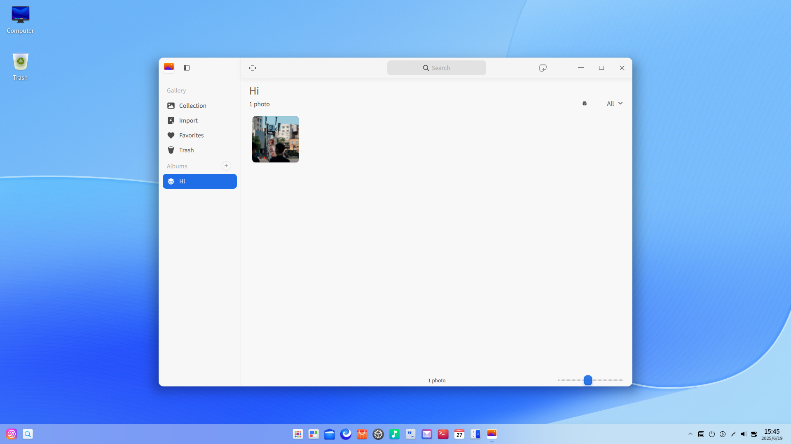

#  Album|deepin-album|

## Overview

Album is a stylish and smooth photo and video management tool, supporting photo and video viewing and managing in various formats. You can sort your photos and videos by date or timeline, add them to the Favorites or category them into different albums to manage photos and videos in perfect order.

## Guide

You can run, close, and create a desktop shortcut for Album in the following ways.

### Run Album

1. Click the Launcher icon  in the Dock and enter the Launcher interface.
2. Locate Album  by scrolling the mouse wheel or searching "album" in the Launcher interface and click it to run.
3. Right-click  and you can:
 - Click **Send to desktop** to create a desktop shortcut.
 - Click **Send to dock** to fix the application in the Dock.
 - Click **Add to startup** to add the application to startup and it will automatically run when the system starts up.

>  Tips: In Control Center, you can set Album as the default photo viewing application. Please refer to [Default Applications](dman:///dde#Default Applications) for specific operations.

### Exit Album

- On the Album interface, clickto exit Album.
- Right-click  in the Dock and select **Close All** to exit Album.
- On the Album interface, click  and select **Exit** to exit Album.

### View Shortcuts

On the Album interface, press **Ctrl** + **Shift** + **?** to view shortcuts. Proficiency in shortcuts will greatly improve your efficiency.

## Photo and Video Management

You are able to manage photos and videos by **Timelines** and **Albums** after launching Album.

### Import Photos and Videos

On the Album interface, you are able to import photos and videos as follows:
- Click **Import Photos and Videos** when there is no photo or video in the album.
- Click the  icon on the title bar.
- Drag the photo and video file to the Album interface.
- Click ** > Import folders** to import custom folders of photos or videos.
- Import photos and videos from the mobile device.

### Search Photos and Videos

1. In the search box on top of the Album interface, click  to enter keywords.
2. Press the **Enter** key on the keyboard to locate the photos or videos quickly.

### View Photos and Videos

Click the scroll bar on the Album interface to adjust the thumbnail size of photos and videos. 

Click **All** on the right top corner to view all the photos and videos. Click **Photos** to view photos only. Click **Videos** to view videos only.

Double-click the photo, or right-click the photo and select **View** to enter the photo viewing interface. Press **Esc** on the keyboard to exit. Double-click the video, or right-click the video and select **View** to enter the Movie interface to play the video. 

| Icon                                                    | Name                    | Description                                                  |
| ------------------------------------------------------- | ----------------------- | ------------------------------------------------------------ |
|               | Back                    | Back to the main interface.                                  |
|                      | Previous                | Switch to the previous photo.                                |
|                              | Next                    | Switch to the next image.                                    |
|                | 1:1 Size                | The photo will be displayed in 1:1 size without changing the size of the window. |
|                 | Fit to window           | The photo will be resized to adapt to the current window.    |
|  | Rotate clockwise        | Rotate the photo 90 degrees clockwise.                       |
|                        | Favorite                | Add favorite photos to your Favorites.                       |
|                                | Extract text            | Recognize texts on the image.                                |
|              | Rotate counterclockwise | Rotate the photo 90 degrees counterclockwise.                |
|                          | Delete                  | Delete the current photo.                                    |

&nbsp;&nbsp;&nbsp;&nbsp;&nbsp;&nbsp;&nbsp;&nbsp;&nbsp;&nbsp;&nbsp;&nbsp;&nbsp;
>  Tips: Scroll the mouse wheel to enlarge the picture. If the photo size exceeds the window, a navigation window will appear at the lower part. Drag the box in the window to fast locate the corresponding photo areas. You can click  on the top right corner of the navigation window to close it. Right-click the photo, you can select **Hide navigation window/Show navigation window**.

### View Timelines

In Timelines, all photos and videos are displayed in groups according to the shooting time and recording time. The ones with the same date are displayed together and those with different dates are displayed in different columns. You are able to locate photos and videos of a specific date quickly by Timelines.

### Print Photos

1. On the Album interface, select the photo to be printed and right-click to select **Print**.
2. Select the printer and set the printing parameters.
3. Click **Print**.

### Extract Texts

1. Double-click the photo to enter the Image Viewer interface.
2. Click  on the tool-bar or right-click the photo and select **Extract text** to enter the text extraction interface and extract the texts on the image.
3. You are able to edit, copy and save the recognized texts as TXT, etc.

### Show in Slides 

1. On the Album interface, right-click a photo.
2. Select **Slide show** to play the photo as slides in full screen.
3. Right-click to select **Exit** or press **Esc** on the keyboard to exit. 

### Copy Photos and Videos

1. On the Album interface, right-click a photo or video.
2. Select **Copy**.
3. Right-click on the desktop or in a target place and select **Paste** to copy the photo or video file there.

### Favorite Photos and Videos

1. On the Album interface, right-click a photo or video.
2. Select **Favorite** and the photo or video will be added to the **Favorites** album.
3. Right-click the photo or video in Favorites to **Unfavorite** it.

>  Tips: You can also click **Select** on the top right corner to select multiple photos or videos and click the  icon to favorite them in batches and click  again to unfavorite them.

### Rotate Photos

1. On the Album interface, right-click a photo and select **Rotate clockwise** or **Rotate counterclockwise**.
2. The photo will be rotated clockwise or counterclockwise for 90 degrees.

>    Tips: You can also click **Select** on the top right corner to select multiple photos and click  or  on the interface to rotate the photos in batches.

### Set as Wallpaper

1. Right-click the photo on the Album interface. 
2. Select **Set as wallpaper** to set the current photo as wallpaper.

### Display in File Manager

1. Right-click the photo or video on the Album interface. 
2. Select **Display in file manager** to open the folder where the photo or video is located.

### View Photo and Video Information

1. Right-click the photo or video on the Album interface. 
2. Select **Photo info** or **Video info** to view the detailed information of photos or videos.

### Delete Photos and Videos

You can delete local photos and videos from Album in the following ways:

- Click the  icon on the Album interface when viewing photos.
- On the Album interface, click **Select** on the top right corner to select photos or videos and click .
- Right-click the photo or video and select **Delete**.
- Select the photo or video and press **Delete** on the keyboard.

>  Tips: The deleted photos and videos in the Album are not deleted permanently but are temporarily stored in the **Trash** album. When the number displayed on the photo is 0, the photo and video will be deleted permanently. You are able to restore or permanently delete the photos and videos here in advance.

## Album Management

On the Album interface, you are able to create new albums, manage photos and videos in the album, and view all albums.

The Screenshots, Camera, Draw folders under the Pictures/Videos directory in File Manager will be imported to Album automatically and displayed in the left pannel with the corresponding name as the album name.

### Create New Albums

1. On the Albums interface, Click  or  > **New album**.
2. Enter the album name and click **Create**.

>  Tips: You are able to create a new album by right-clicking a custom album created to select **New album**, or by right-clicking the selected photos or videos and selecting **Add to album**.

### Add Photos and Videos to Albums

1. On the Album interface, right-click a photo or video and select **Add to album**.
2. Select an album and add the photo or video to it.

> Tips: You are also able to drag photos or videos directly to a custom album.

### Delete Photos and Videos from Albums

1. On the Albums interface, right-click a photo or video in a custom album.
2. Select **Remove from album** to remove the photo or video from the album.

### Rename Albums

1. On the Albums interface, right-click a custom album to be renamed and select **Rename**. 
2. Enter the album name and press the **Enter** key on the keyboard, or click the blank area of the interface.

### Export Albums

1. On the Albums interface, right-click an album with photos only.
2. Select **Export**.
3. Select the path to be stored and click **Save** in the pop-up dialog box.

### Delete Albums

1. On the Albums interface, right-click a custom album or an album of custom path.
2. Select **Delete**.
3. Click **Delete** in the pop-up dialog box.

>  Notes: You are only able to delete photos and videos in Album rather than those in your local device.

## Main Menu

In the main menu, you can [Create New Albums](#Create New Albums), switch window themes, view help manual, and get more information about Album.

### Theme

The window theme provides three theme types, namely Light Theme, Dark Theme, and System Theme.

1.  Click  on  the Album interface.
2.  Click **Theme** to choose one theme.

### Help

1.  Click  on  the Album interface.
2.  Click **Help** to view the manual of Album.

### Feedback

1. Click  on  the Album interface.
2. Click **Feedback** and pops up the authentication window.
3. Fill in your password and submit your feedback in the forum of deepin.

### About

1.  Click  on  the Album interface.
2.  Click **About** to view the version and introduction of Album.

### Exit

1.  Click  on  the Album interface.
2.  Click **Exit** to exit Album.