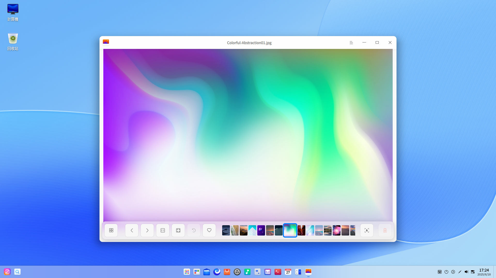

<!--
SPDX-FileCopyrightText: 2023 UnionTech Software Technology Co., Ltd.

SPDX-License-Identifier: GPL-3.0-or-later
-->

# 相冊|deepin-album|

## 概述

相冊是一款外觀時尚、性能流暢的照片和影片管理工具，支持查看、管理多種圖片和影片格式。您可以按日期時間線排列照片和影片，還可以將照片和影片添加到我的收藏，或者歸類到不同的相冊中，將照片和影片管理得井井有條。

## 使用入門

通過以下方式運行或關閉相冊，或者創建相冊的快捷方式。

### 運行相冊

1. 單擊任務欄上的啟動器圖標 ，進入啟動器界面。
2. 上下滾動鼠標滾輪瀏覽或通過搜索，找到相冊圖標  ，單擊運行。
3. 右鍵單擊 ，您可以：
 - 單擊 **發送到桌面**，在桌面創建快捷方式。
 - 單擊 **發送到任務欄**，將應用程序固定到任務欄。
 - 單擊 **開機自動啟動**，將應用程序添加到開機啟動項，在電腦開機時自動運行該應用。

   > 竅門：您可以在控制中心將相冊設置為默認的照片查看程序，具體操作請參考 [默認程序設置](dman:///dde#默認程序設置)。

### 關閉相冊

- 在相冊界面，單擊 ，退出相冊。
- 在任務欄右鍵單擊 ，選擇 **關閉所有** ，退出相冊。
- 在相冊界面，單擊 ，選擇 **退出** ，退出相冊。

### 查看快捷鍵

在相冊界面，使用快捷鍵 **Ctrl + Shift + ?** 打開快捷鍵預覽界面。熟練地使用快捷鍵，將大大提升您的操作效率。

## 照片和影片管理

啟動相冊後，通過時間線和相冊來管理您的照片和影片。

### 導入照片和影片

在相冊界面，可以採用以下方式導入照片和影片。

- 當相冊中尚無照片和影片時，單擊 **導入照片和影片**。
- 單擊右上角的添加按鈕 。
- 直接將照片和影片文件拖拽到相冊界面上。
- 單擊  > **從文件夾導入**，導入自定義的照片或影片文件夾。
  
- 從移動設備導入照片和影片。

### 搜索照片和影片

1. 在相冊搜索框中，單擊，輸入關鍵字。
2. 按下鍵盤上的 **Enter** 鍵後顯示搜索結果。

### 查看照片和影片

在相冊界面，拖動右下角的滑塊可以調整照片和影片的縮略圖大小。

單擊右上角的 **所有項目**，查看所有照片和影片；單擊 **照片**，僅查看照片文件；單擊 **影片**，僅查看影片文件。

雙擊照片或右鍵單擊照片選擇 **查看** ，進入查看圖片界面；雙擊影片或右鍵單擊影片選擇 **查看**，進入影院界面播放影片文件。

| 圖標                                                    | 名稱       | 說明                         |
| ------------------------------------------------------- | ---------- | ---------------------------- |
|               | 返回       | 返回到主界面。               |
|                      | 上一張     | 顯示上一張照片。             |
|                              | 下一張     | 顯示下一張照片。             |
|                | 1:1視圖    | 照片按照實際尺寸顯示。       |
|              | 適應窗口   | 照片適應窗口尺寸顯示。       |
|                        | 收藏       | 將喜歡的照片添加到個人收藏。 |
|                        | 識別文字     | 識別圖片中的文字。 |
|  | 順時針旋轉 | 照片順時針旋轉90度。         |
|              | 逆時針旋轉 | 照片逆時針旋轉90度。         |
|                          | 刪除       | 刪除當前照片。               |

   >  竅門：滾動鼠標放大圖片且當圖片超出界面範圍時，界面上會出現導航窗口。拖動導航窗口內的方框，查看該區域的訊息。單擊導航窗口中的關閉按鈕 **×**，關閉導航窗口；也可以在界面上單擊鼠標右鍵選擇 **隱藏導航窗口** / **顯示導航窗口**。

### 查看時間線

在時間線中，所有照片、影片按照拍攝時間和影片錄製時間分組顯示，不同日期的文件分欄排列。查看時間線可以快速找到某一天的文件。

### 打印照片

1. 在相冊界面，右鍵單擊照片，選擇 **打印**。
2. 選擇一個打印機，根據需要設置打印屬性。
3. 選擇 **打印**，將照片發送到打印機進行打印。

### 識別文字

1. 在相冊界面，雙擊照片進入查看圖片界面。
2. 單擊工具欄上的按鈕  或右鍵單擊圖片，選擇 **識別文字**，彈出圖文識別窗口，識別圖片中的文字。
3. 您可以對識別出的文字進行編輯、複製或保存為TXT等操作。

### 幻燈片放映

1. 在相冊界面，右鍵單擊照片。
2. 選擇 **幻燈片放映**，照片將以幻燈片形式全螢幕播放。
3. 右鍵單擊選擇 **退出** 或按下鍵盤上的 **Esc** 鍵退出播放。

### 複製照片和影片

1. 在相冊界面，右鍵單擊照片或影片。
2. 選擇 **複製**。
3. 在桌面或者指定位置，單擊鼠標右鍵。
4. 選擇 **黏貼**，將照片或影片文件複製到該位置。

### 收藏照片和影片

1. 在相冊界面，右鍵單擊照片或影片。
2. 選擇 **收藏**，照片或影片文件將會添加到「我的收藏」。
3. 右鍵單擊已收藏的照片或影片，也可以 **取消收藏**。

   >  竅門：您也可以單擊界面右上角的 **選擇**，選中多張照片或影片，單擊收藏按鈕  批量收藏照片或影片；再次單擊 ，取消收藏。

### 旋轉照片

1. 在相冊界面，右鍵單擊照片。
2. 選擇 **順時針旋轉** / **逆時針旋轉**。
3. 照片會順時針轉旋轉90°/逆時針旋轉90°。

 >  竅門：您也可以單擊界面右上角的 **選擇**，選中多張照片，單擊旋轉按鈕  和  批量旋轉照片。

### 設置為壁紙

1. 在相冊界面，右鍵單擊照片。
2. 選擇 **設為壁紙**，將當前照片設置為壁紙。

### 在檔案管理員中顯示

1. 在相冊界面，右鍵單擊照片或影片。
2. 選擇 **在檔案管理員中顯示**，定位照片或影片所在的文件夾位置。

### 查看照片和影片訊息

1. 在相冊界面，右鍵單擊照片或影片。
2. 選擇 **照片訊息** 或 **影片訊息**， 查看照片或影片的詳細訊息。

### 刪除照片和影片

在相冊中可通過以下方法之一刪除本地照片或影片：

- 查看圖片時，單擊工具欄上的圖標 。
- 在相冊界面單擊右上角的 **選擇**，選中照片或影片，單擊圖標 。
- 右鍵單擊照片或影片，選擇 **刪除**。
- 選擇照片或影片，按下鍵盤上的 **Delete** 鍵。

   >  竅門：在相冊中刪除的照片和影片並沒有被永久刪除，而是暫時存放在“最近刪除”中。當剩餘天數顯示為0天時，照片和影片將被永久刪除。您可以提前恢復或徹底刪除這裏的照片和影片。

## 相冊管理

在相冊界面，您可以查看相冊、新建相冊以及管理相冊中的照片和影片。

相冊會自動導入 **檔案管理員** > **圖片** / **影片** 目錄下的 Screenshots、Camera、Draw 文件夾內容，並在左側導航欄創建對應的相冊名稱（截圖錄屏、相機、畫板）。

### 新建相冊

1. 在相冊界面，單擊按鈕  或   > **新建相冊**。
2. 輸入相冊名稱，單擊 **新建**。

   >  竅門：右鍵單擊自定義相冊也可以新建相冊。您還可以選定照片或影片後在添加到相冊菜單中新建相冊。

### 添加到相冊

1. 在相冊界面，右鍵單擊照片或影片。
2. 選擇 **添加到相冊**。
3. 選擇一個相冊，將照片或影片添加到相冊中。

   >  竅門：也可以直接將照片或影片文件拖拽到自定義的相冊中。

### 從相冊中移除

1. 在相冊界面，右鍵單擊自定義相冊中的照片或影片。
2. 選擇 **從相冊中移除**，將該照片或影片從相冊中移除。

### 重命名相冊

1. 在相冊界面，右鍵單擊自定義相冊。
2. 選擇 **重命名**。
3. 輸入相冊名稱，按下 **Enter** 鍵或者單擊界面的空白區域保存修改。

### 導出相冊

1. 在相冊界面，選擇僅含照片的相冊。
2. 右鍵單擊鼠標，選擇 **導出**。
3. 在彈窗中選擇存儲路徑，單擊 **保存**。

### 刪除相冊

1. 在相冊界面，右鍵單擊自定義或自定義路徑相冊。
2. 選擇 **刪除**。
3. 在彈出的對話框中單擊 **刪除**。

>  說明：以上刪除操作，僅能刪除相冊應用中的照片和影片，而不會刪除存儲在本地的照片和影片。

## 主菜單

在主菜單中，您可以 [新建相冊](#新建相冊)、切換窗口主題、查看幫助手冊，了解相冊的更多訊息。

### 主題

窗口主題包含淺色主題、深色主題和系統主題。

1. 在相冊界面，單擊 。
2. 選擇 **主題**，選擇一個主題顏色。

### 幫助

查看幫助手冊，進一步了解和使用相冊。

1. 在相冊界面，單擊 。
2. 選擇 **幫助**。
3. 查看相冊的幫助手冊。

### 關於

1. 在相冊界面，單擊 。
2. 選擇 **關於**。
3. 查看相冊的版本和介紹。

### 退出

1. 在相冊界面，單擊 。
2. 選擇 **退出**。
